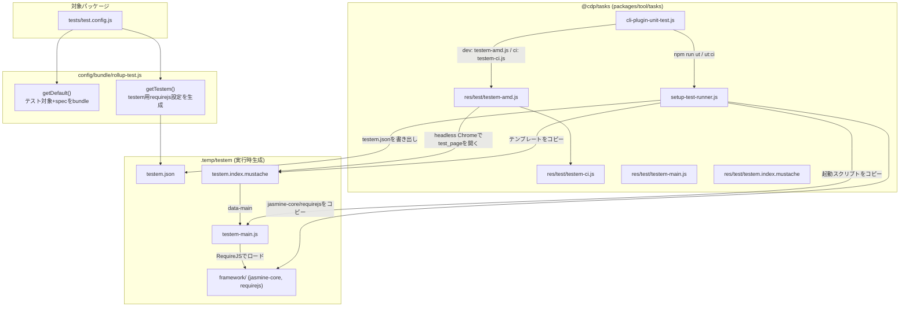
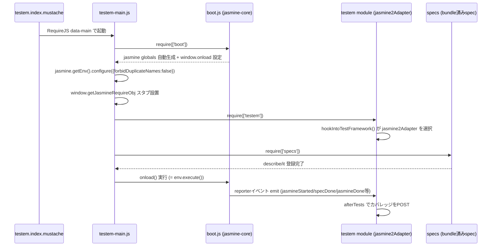

# ユニットテスト

## 概要

本リポジトリのユニットテストは実行環境によって2方式に分かれる。

1. Node実行方式: Node.js 専用パッケージ (`packages/lib/node/*` 等) が対象。`jasmine` CLI を直接使用する
2. Browser実行方式: Web/Worker/UIコンポーネント等ブラウザ実行を前提とするパッケージが対象。`testem` + headless Chrome を使用する

いずれも `cdp-task`(`packages/tool/tasks`)がタスクランナーとして各種セットアップ・実行・カバレッジ集計を仲介する。

## 実行方式比較

| 項目 | Node実行方式 | Browser実行方式 |
|------|------|------|
| テストランナー | `jasmine` CLI | `testem`(headless Chrome) |
| 設定ファイル | [config/test/jasmine.js](../../config/test/jasmine.js) | パッケージ内 `tests/test.config.js` + [config/bundle/rollup-test.js](../../config/bundle/rollup-test.js) |
| モジュール解決 | CommonJS (Node) | RequireJS(AMD)、`rollup` でバンドル後に読み込み |
| 起動コマンド例 | `jasmine --config=.../config/test/jasmine.js` | `cdp-task unit-test [mode] --config=./tests/test.config.js` |
| 対象パッケージ例 | `packages/lib/node/storage` | `packages/lib/core/utils` 等の大半 |

## Browser実行方式のアーキテクチャ



1. パッケージ内の `tests/test.config.js` が `rollup-test.js` の `getDefault()`(テスト対象+specのバンドル定義)と `getTestem()`(testem用 requirejs 設定)を呼び出す
2. `cli-plugin-unit-test.js` が `npm run ut` / `ut:ci` の実体で、モードに応じて `setup-test-runner.js` → `testem` 起動 → (ciモードのみ)カバレッジ計装・レポート生成、を順に実行する
3. `setup-test-runner.js` は `jasmine-core`・`requirejs` の実体ファイルと起動スクリプト一式を `.temp/testem` に展開する
4. `testem-amd.js`(dev)/`testem-ci.js`(ci)が実際の `testem` 設定で、headless Chrome 等で `testem.index.mustache` を test_page として開く
5. ページ内では `testem-main.js` が RequireJS のエントリとして jasmine の起動・spec 読み込み・実行を制御する

## `cli-plugin-unit-test.js` のモード一覧

`cdp-task unit-test [mode]`(alias: `ut`)で指定する `mode` によって処理が分岐する([cli-plugin-unit-test.js](../../packages/tool/tasks/lib/cli-plugin-unit-test.js)参照)。

| mode | 用途 |
|------|------|
| (未指定) | `setup` → `testem`(dev, ブラウザ起動したまま待機) |
| `ci` | カバレッジクリア → `setup` → `nyc instrument` → `testem ci`(headless) → remap → report |
| `instrument` | `nyc instrument` のみ実行 |
| `remap` | カバレッジのソースマップ再マッピングのみ実行(確認用) |
| `report` | `nyc report` のみ実行 |
| その他(任意文字列) | 指定した npm script を `nyc` でフックして実行(Node実行方式向け) |

## Browser実行時の起動シーケンス(testem-main.js)



## jasmine-core v7 対応に関する知見

jasmine-core が v7 に上がった際、testem 連携部分が2点破綻した。今後 jasmine-core / testem をアップデートする際は同様の箇所を確認する。

### 1. `boot0.js` / `boot1.js` が `boot.js` に統合

- v6以前: `boot0.js`(jasmine env 作成) + `boot1.js`(HTMLレポーター登録・`window.onload` 設定)の2ファイル構成
- v7: 単一の `boot.js` に統合。また `jasmine.js` 自体がブラウザ実行時に `jasmine`/`describe`/`expect` 等のグローバルを自動生成するようになった(`installGlobals()`)ため、env作成の明示的な事前準備は不要になった
- 対応箇所:
  - [setup-test-runner.js](../../packages/tool/tasks/lib/setup-test-runner.js): `boot.js` を1ファイルのみコピー
  - [rollup-test.js](../../config/bundle/rollup-test.js) の `getTestem()`: requirejs `paths` を `boot0`/`boot1` → `boot` に一本化、`shim` の `deps` 指定は不要
  - [testem-main.js](../../packages/tool/tasks/res/test/testem-main.js): `require(['boot1'], ...)` → `require(['boot'], ...)`

### 2. testem の jasmine2 自動判定が効かなくなり CI がハングする

- 原因: `testem_client.js` の `hookIntoTestFramework()` は `typeof getJasmineRequireObj === 'function'` で jasmine v2〜v6系を判定しているが、jasmine-core v7 では「redesigned module system」により `jasmineRequire`(= `getJasmineRequireObj`)がグローバル非公開になった
- 結果: 判定が `else if (typeof jasmine === 'object')` 側に落ち、jasmine v1 用の古い `jasmineAdapter`(`reportRunnerStarting` 等、現行APIに存在しないメソッドが前提)が誤って選択される。テスト結果イベントが一切 emit されないため、`testem ci` がテスト完了を待ち続けて無応答になる(Ctrl+C = exit 130)
- 対応: [testem-main.js](../../packages/tool/tasks/res/test/testem-main.js) で `require(['testem'])` の直前に `window.getJasmineRequireObj` のダミー関数を用意し、判定を `jasmine2Adapter`(`jasmine.getEnv().addReporter()` のみに依存する実装で v7 でも動作)側に強制する

```javascript
// jasmine-core v7 で `getJasmineRequireObj` が非公開になり、testem の jasmine2 自動判定が効かなくなるための救済
window.getJasmineRequireObj = window.getJasmineRequireObj || function() { /* noop */ };
```

### アップデート時の確認ポイント

1. `node_modules/jasmine-core/lib/jasmine-core/` 配下のファイル構成(`boot.js` の有無・分割状況)
2. `node_modules/testem/public/testem/testem_client.js` の `hookIntoTestFramework()` によるフレームワーク自動判定ロジック
3. `node_modules/testem/public/testem/jasmine2_adapter.js` が依存する jasmine の公開APIに変更がないか
